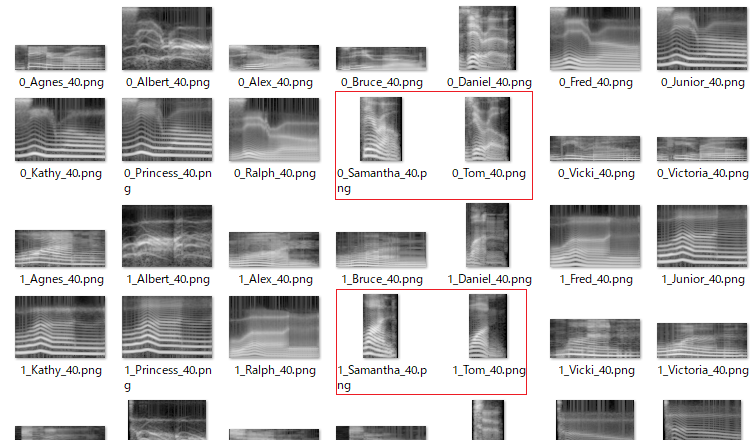
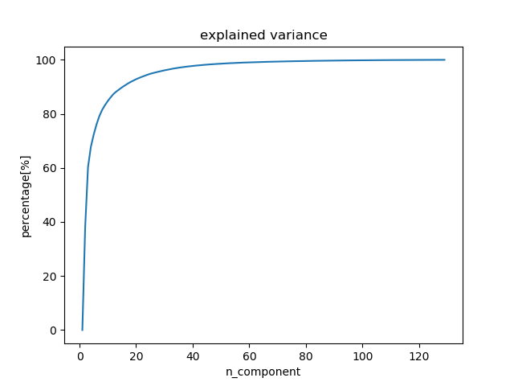
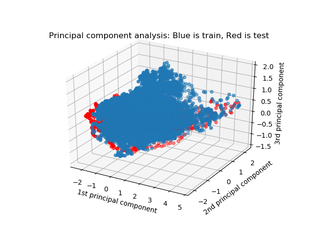
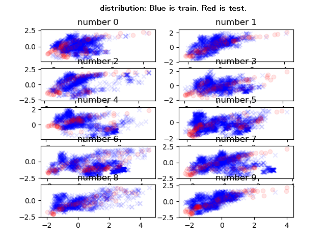
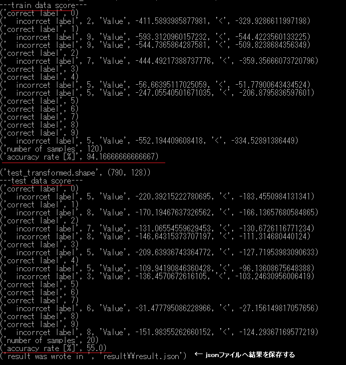

# HMM 

## 概要  

数字の発話のメル尺度のスぺクトログラムを使って、主成分分析により特徴量の次元数を少なくして、混合分布の隠れマルコフモデル（HMM）を使って識別するもの。練習用。　隠れマルコフモデルのライブラリhmmlearnを使用。  
 

[github repository](https://github.com/shun60s/HMM)

## 使い方  
### 1.スペクトログラムの作成  

数字の発話（英語）のWAVEファイルをダウンロードする。  <http://pannous.net/files/spoken_numbers_wav.tar>  
(データの中身の情報 <https://github.com/AKBoles/Deep-Learning-Speech-Recognition/blob/master/Pannous-Walkthrough.md> )  
wavディレクトリーに移動する。ファイル名称の中にSteffi（名前）が含まれるデータは除いた。 
```
python make_spectrogram.py
```
フィルターバンクの数や、使用する周波数の幅、フレーム分析長さ（FFTの次数、シフト値）なども可変設定できる。
WAVファイルの発話の速さ（例：40だけ）の条件で排除できる。
spectrogramディレクトリーに出力される。
spectrogram.zipは出力された例。  
  


### 2.訓練用とテスト用のデータセットの作成  

主成分分析を行い、寄与率を計算し、おおよその（必要となりそうな）次元数を割りだす。
  
連続したフレームも1個のデータとして使う設定もできる。

```
python pca.py
```

テスト評価に使う名前を指定する。（例：TestNames=['Samantha', 'Tom']) テスト用以外の全員が訓練用になる。  
  
赤のテスト用の試料は、青の訓練用の塊と離れているので、識別が成功しそうにない様子がうかがえる。  

DataSetディレクトリーに訓練用とテスト用のデータセットが出力される。  


### 3.数字ごとの分布の様子  
参考に、数字ごとの分布の様子も見てみる。

```
python distribution_check.py
```

  


### 4.識別実験

10個のHMMのなかで、最大確率を出すものを回答として識別する。　（判定不能となる）最低必要な確率の閾値は設けていない。
各単語（英語の数字）に含まれる音素数を無視して、すべて同じ隠れ状態数のHMMを使った。  
```
python main.py
```

特徴量の次元数、ガウス分布の混合の数、HMMの隠れ状態の数を指定できる。　
発話を均等に隠れ状態数で分割したもののK-MEAN法のクラスタリングのセントロイドをガウス分布の平均値の初期値として使用した。  
Left-to-Rightの1方向で初期化してある。  
  
訓練用のデータ数が少ないため、HMMのEM計算途中でエラーが発生して　停止することもある。
Resultディレクトリーに結果がJSONファイルとして出力される。 

## ライセンス  
melbank.pyは　それに記載されているライセンスに従うこと。


## 参照したもの  

- [Python のHMMライブラリ hmmlearn](http://hmmlearn.readthedocs.io/en/latest/tutorial.html)
- [wav of Pannous](https://github.com/AKBoles/Deep-Learning-Speech-Recognition/blob/master/Pannous-Walkthrough.md)
- [Python の主成分分析 scikit learn](http://scikit-learn.org/stable/modules/generated/sklearn.decomposition.PCA.html)
- [Python のクラスタリング scikit learn](http://scikit-learn.org/stable/modules/generated/sklearn.cluster.KMeans.html)


## 免責事項　
  
THE SOFTWARE IS PROVIDED "AS IS", WITHOUT WARRANTY OF ANY KIND, EXPRESS OR IMPLIED, 
INCLUDING BUT NOT LIMITED TO THE WARRANTIES OF MERCHANTABILITY, FITNESS 
FOR A PARTICULAR PURPOSE AND NONINFRINGEMENT. IN NO EVENT SHALL 
THE AUTHORS OR COPYRIGHT HOLDERS BE LIABLE FOR ANY CLAIM, DAMAGES OR OTHER LIABILITY, 
WHETHER IN AN ACTION OF CONTRACT, TORT OR OTHERWISE, ARISING FROM, 
OUT OF OR IN CONNECTION WITH THE SOFTWARE OR THE USE OR OTHER DEALINGS IN THE SOFTWARE.  
#### 上記はMITライセンスからの抜粋です。 


